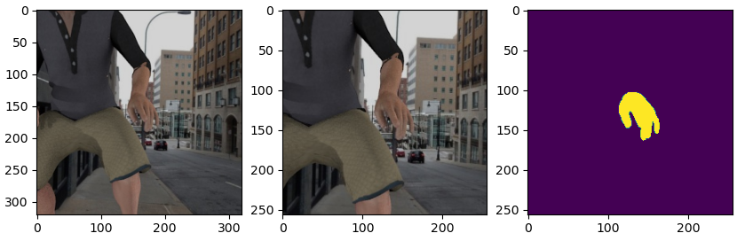
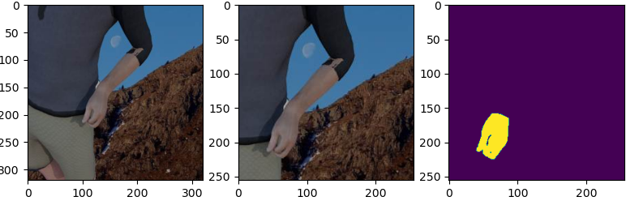
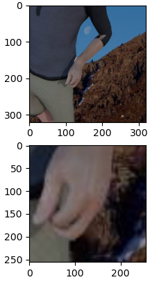
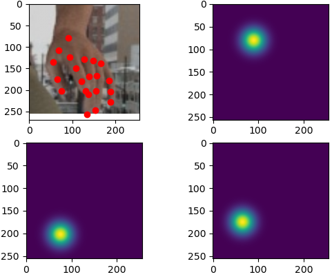
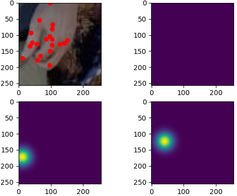

# 3d_handpose

Paper: [Learning to Estimate 3D Hand Pose from Single RGB Images](https://arxiv.org/pdf/1705.01389v3.pdf)

# Implementation
## Tested Environments
Environment system (tested):
- Windows 10 
- Pytorch 1.5.0 GPU build with CUDA 10.2 and CUDNN 7.6.5
- Python 3.7

Python packages used by the example provided:
- matplotlib
- numpy
- skimage
- torchvision

## Overall Model Architecture

모델은 총 세 개의 하위 모델들로 이루어져 있다.  
(1) HandSegNet에서는 이미지에서 양 손은 찾는다.  
(2) PoseNet 에서는 손 이미지에서 21개의 keypoints를 찾는다. 각각의 keypoints는 손바닥, 엄지, 손목... 등등을 가리킨다. 
(3) PriorPose 에서는 2D - keypoints를 3D 로 매핑하는 역할을 한다. 

### HandSegNet
 
</img> 
</img> 
</img> 

Input (3x256x256): RHD dataset 기준으로 360x360 이미지를 입력받아 256x256 크기로 랜덤하게 잘라낸다.   
Label (256x256): Mask data는 배경은 0, 사람은 1, 왼손은 2~17, 오른손은 18~ 로 표기 되어 있다. 여기서 양 손을 1 나머지는 0으로 처리한다. 

Loss: 각 픽셀 당 BinaryCrossEntropy Loss를 적용하여 학습시킨다. 

### CropImage
</img>
</img>
</img> 

HandSegNet의 결과를 바탕으로 이미지에서 손만을 잘라낸다.  
Training 시엔 오른손과 왼손 중에서 더 큰 면적을 차지하는 손만을 잘라낸다.

### PoseNet
</img> 
</img> 
</img> 

Input (3x256x256): 잘라낸 손의 이미지를 256x256으로 Scaling 한다. 손의 keypoint 좌표값도 이에 맞게 조정해준다. (왼쪽 상단 이미지의 빨간색 점) 
Label (256x256x21): scoremap 이라고 칭하며, keypoint 좌표를 중심으로하여 가우시안 형태로 0~1사이의 값을 가진다. 256x256 한 개의 마스크가 keypoint 한개와 mapping되므로 총 21장의 scoremap이 있다.  
Output (3x32x32x21): Convolution Network인 PoseNet 에서 중간 layer 2개와 마지막 layer를 output으로 한다. 

Loss: 세 개의 output과 label간의 mse loss를 적용하여 학습시킨다. 

### PriorPose
Input (32x32x21): PoseNet 3개의 output을 AveragePooling 한 값을 입력으로 한다.  
Label (21x3, 3x3): 21개의 keypoint 좌표와 Rotation Matrix 
Output (63, 3x3): 2개의 convolution network stream의 output을 통해 예측한다. 

Loss: 각각 두개의 output과 label 간의 mse loss를 적용하여 학습시킨다.  

# To do
* Weight Initialize : 논문에선 pretrain 된 segmentation model로 가중치 값을 초기화 시킨 후 학습한다고 하였으나, pytorch로 학습된 모델이 없어서 시간상 생략하였다.
* Evaluation : 실험을 위해 추가적으로 구현해야 하는 코드는 시간상 생략하였다.
* 다양한 augmentation 방법 혹은 noise 추가

